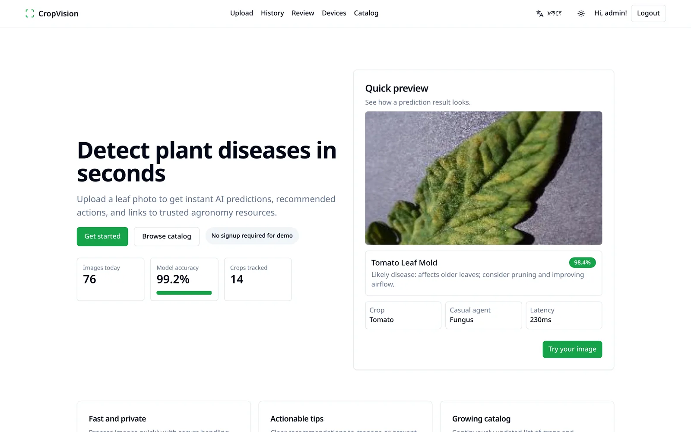
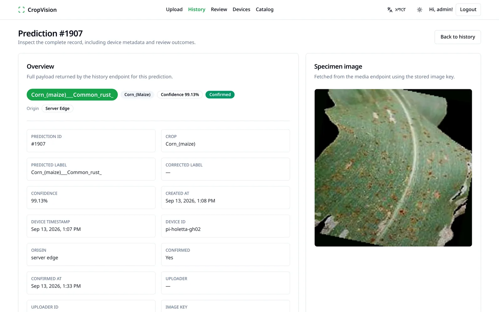
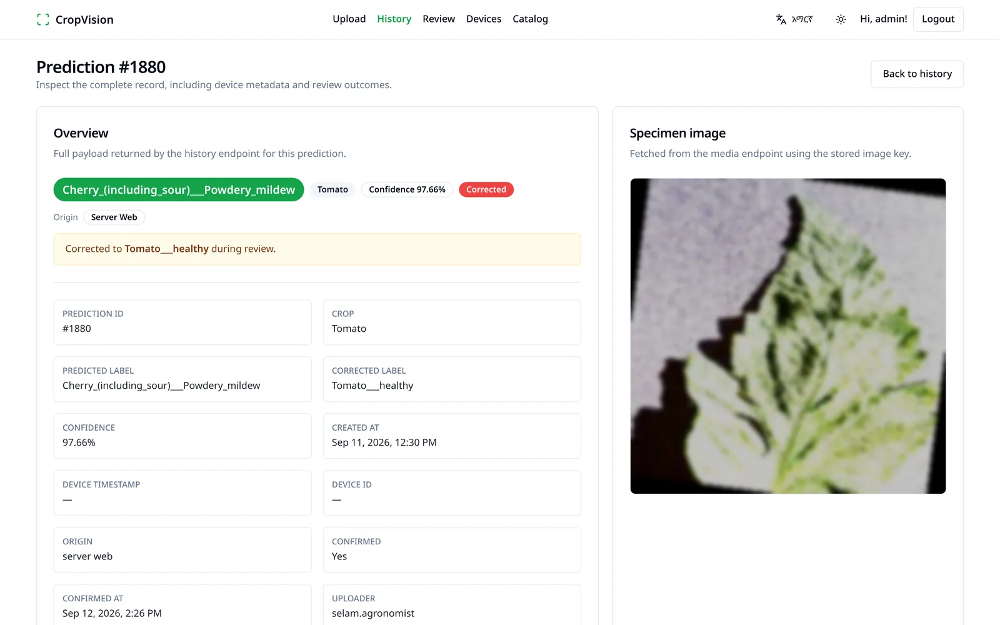
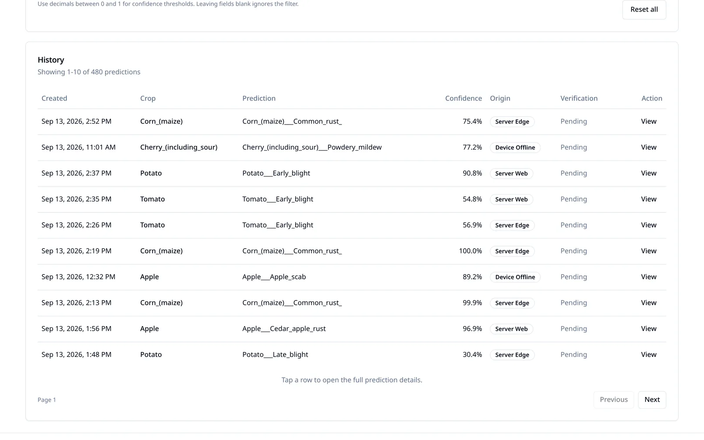
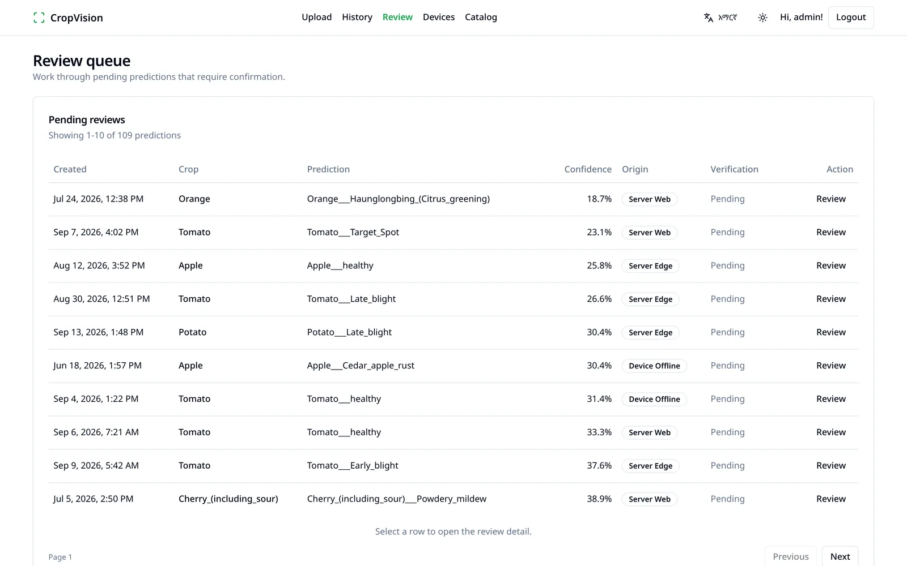
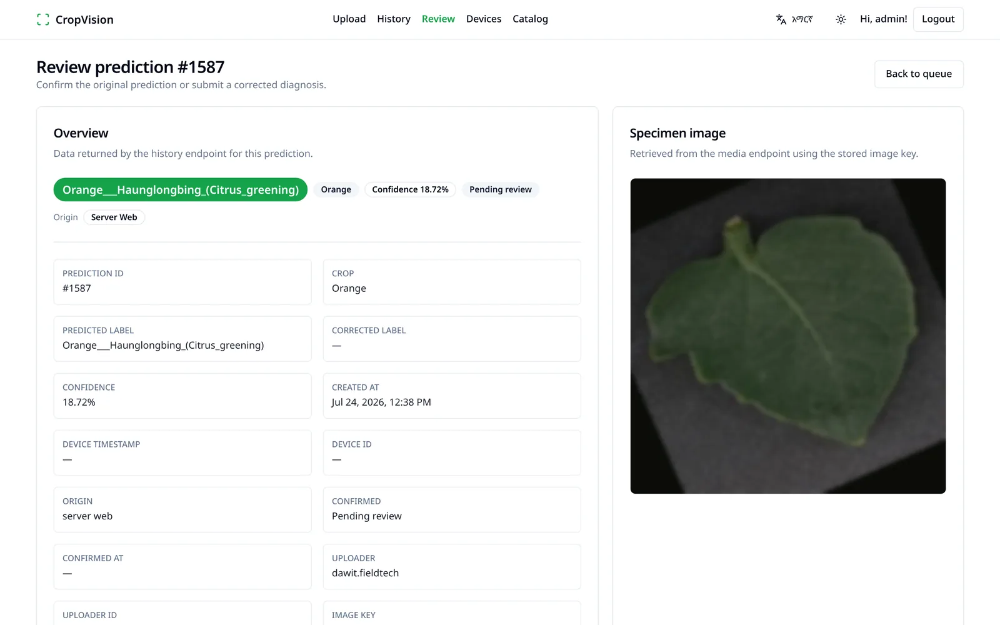
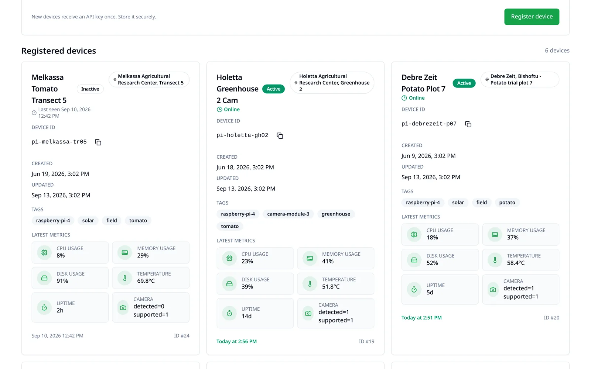
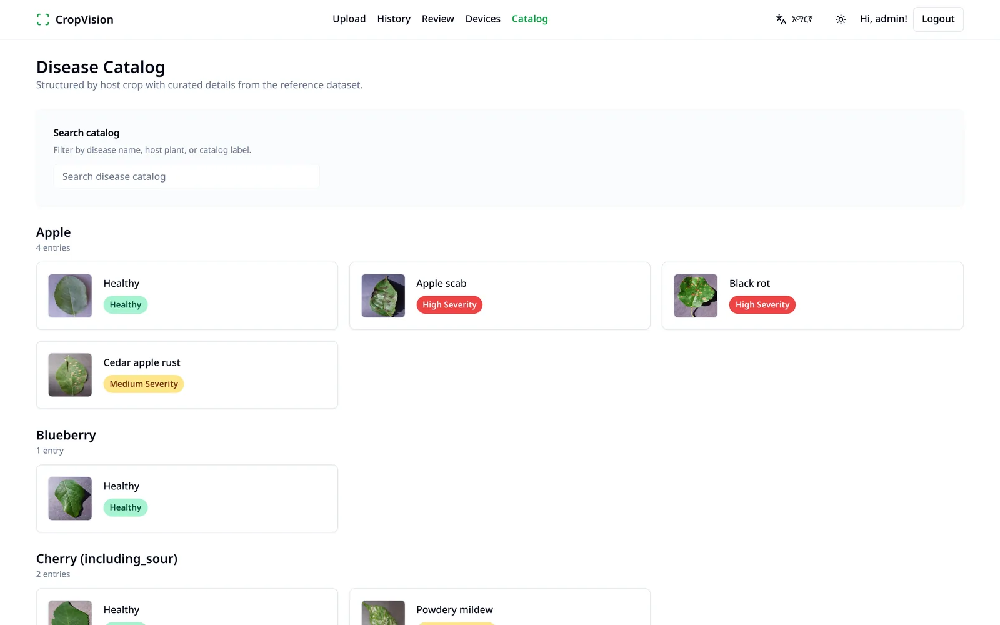
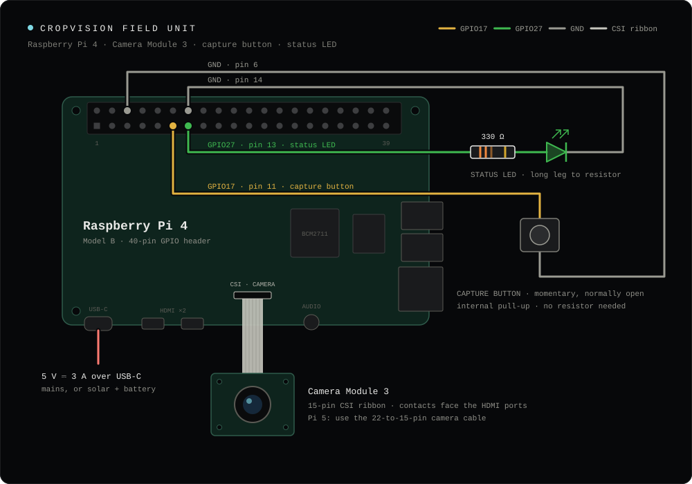

# CropVision — Web Client

**Frontend client** for **CropVision**, a plant disease detection platform. Upload a leaf photo, get an instant diagnosis from a model trained to **99.2% validation accuracy**, review the model's history, and manage a fleet of camera-equipped **edge devices** (Raspberry Pi and similar hardware) submitting predictions from the field.

🔗 Backend API: [crop-vision-backend](https://github.com/tahirmohammedaman/crop-vision-backend)

<p align="center">
  <picture>
    <source media="(prefers-color-scheme: dark)" srcset="docs/screenshots/landing-dark.webp">
    
  </picture>
</p>

## Screenshots

<sub>Views with a dark variant follow your GitHub theme.</sub>

<table>
  <tr>
    <td width="50%">
      <picture>
        <source media="(prefers-color-scheme: dark)" srcset="docs/screenshots/prediction-detail-dark.webp">
        
      </picture>
      <br><sub><b>Prediction record</b> — label, confidence, origin, the Pi that captured it, and the specimen.</sub>
    </td>
    <td width="50%">
      
      <br><sub><b>Corrected prediction</b> — the original label stays next to the reviewer's correction.</sub>
    </td>
  </tr>
  <tr>
    <td width="50%">
      <picture>
        <source media="(prefers-color-scheme: dark)" srcset="docs/screenshots/history-dark.webp">
        
      </picture>
      <br><sub><b>History</b> — web, edge and offline predictions in one filterable log.</sub>
    </td>
    <td width="50%">
      <picture>
        <source media="(prefers-color-scheme: dark)" srcset="docs/screenshots/review-queue-dark.webp">
        
      </picture>
      <br><sub><b>Review queue</b> — low-confidence predictions for a human to confirm or correct.</sub>
    </td>
  </tr>
  <tr>
    <td width="50%">
      
      <br><sub><b>Review a prediction</b> — confirm the call or submit a corrected diagnosis.</sub>
    </td>
    <td width="50%">
      <picture>
        <source media="(prefers-color-scheme: dark)" srcset="docs/screenshots/devices-dark.webp">
        
      </picture>
      <br><sub><b>Devices</b> — Raspberry Pi field units with live heartbeat telemetry.</sub>
    </td>
  </tr>
  <tr>
    <td width="50%">
      
      <br><sub><b>Predict</b> — disease, confidence, description and recommended actions.</sub>
    </td>
    <td width="50%">
      
      <br><sub><b>Disease catalog</b> — all 38 classes, grouped by host plant.</sub>
    </td>
  </tr>
</table>

## Features

- **Predict** — drag-and-drop or capture a leaf image and get a crop + disease classification with a confidence breakdown across all classes.
- **History** — a searchable, filterable log of every prediction (crop, disease, tags, confidence range, date range, source), whether it came from the web app or an edge device.
- **Review queue** — surfaces low-confidence predictions for a human to confirm or correct, closing the feedback loop with the model.
- **Stats dashboard** — running accuracy computed from confirmed/corrected predictions.
- **Disease catalog** — a browsable, searchable encyclopedia of the 38 crop/disease classes the model recognizes, grouped by host plant with reference imagery.
- **Model info** — inspect metadata about the currently deployed model.
- **Auth** — login/register against the FastAPI backend, JWT persisted client-side with automatic redirect-to-login on expiry.
- **Internationalization** — English/Amharic language switcher.

## The model behind it

Every diagnosis comes from a **ResNet9 trained from scratch** on the [New Plant Diseases Dataset](https://www.kaggle.com/datasets/vipoooool/new-plant-diseases-dataset) (Kaggle, augmented PlantVillage):

| | |
|---|---|
| Validation accuracy | **99.19%** |
| Held-out test images | **33 / 33** correct |
| Training data | 70,295 images · 17,572 for validation |
| Classes | 38 — 14 crops, 26 diseases |
| Size | 6.59M parameters, 256×256 RGB input |
| Training | 2 epochs, Adam + one-cycle LR, single GPU |

Dataset, architecture, the full training log and how to reproduce it are in the [backend README](https://github.com/tahirmohammedaman/crop-vision-backend#the-model).

## Edge device management

A dedicated **Devices** page treats Raspberry Pi (and similar) hardware as managed fleet assets rather than an afterthought:

- Register a new edge device and receive a scoped API key for it to authenticate with.
- Live status per device — online/offline derived from last-seen heartbeat, with CPU load, memory, disk usage, uptime, CPU temperature, and camera availability rendered from the telemetry the device reports.
- Copy/rotate device credentials, tag and locate devices, and deactivate hardware that's been retired.
- Every prediction in **History** is labeled with its origin (web upload, server-assisted edge capture, or fully offline on-device inference) and links back to the device that produced it — so field hardware and the web UI share one unified data view.

### What a field unit looks like

A Raspberry Pi 4, a Camera Module 3 on the CSI connector, a capture button and a status LED — press the button, and the photo is classified and shows up on this client's **History** and **Devices** pages.

<p align="center">
  
</p>

| Part | Pi header |
|---|---|
| Camera Module 3 | CSI connector (Pi 5: 22-to-15-pin cable) |
| Capture button | GPIO17 (pin 11) ↔ GND (pin 6) |
| Status LED + 330 Ω | GPIO27 (pin 13) → LED → GND (pin 14) |

The capture script, systemd unit and setup notes live in the [backend README](https://github.com/tahirmohammedaman/crop-vision-backend#wiring-a-raspberry-pi-field-unit), next to `pi_predict_edge.py` and `pi_heartbeat_script.py`.

## Tech stack

| Layer | Technology |
|---|---|
| Framework | React 18 + TypeScript, built with Vite |
| Styling | Tailwind CSS + shadcn/ui component patterns, Radix primitives |
| Data fetching | TanStack Query + Axios |
| Forms & validation | React Hook Form + Zod |
| Routing | React Router |
| i18n | Custom translation provider (English / Amharic) |
| Infra | Docker + nginx, ESLint, TypeScript strict mode |

## Getting started

```bash
pnpm install
cp .env.example .env    # set VITE_API_BASE_URL to point at crop-vision-backend
pnpm dev
```

```bash
pnpm build      # typecheck + production build
pnpm lint       # ESLint
pnpm typecheck  # TypeScript project references
```

Or with Docker (served via nginx):

```bash
docker build -t crop-vision-frontend .
docker run -p 8080:80 crop-vision-frontend
```

## Pages

Landing · Login / Register · Predict (Upload) · History · Review Queue · Stats · Disease Catalog · **Devices** · Model Info · Profile
